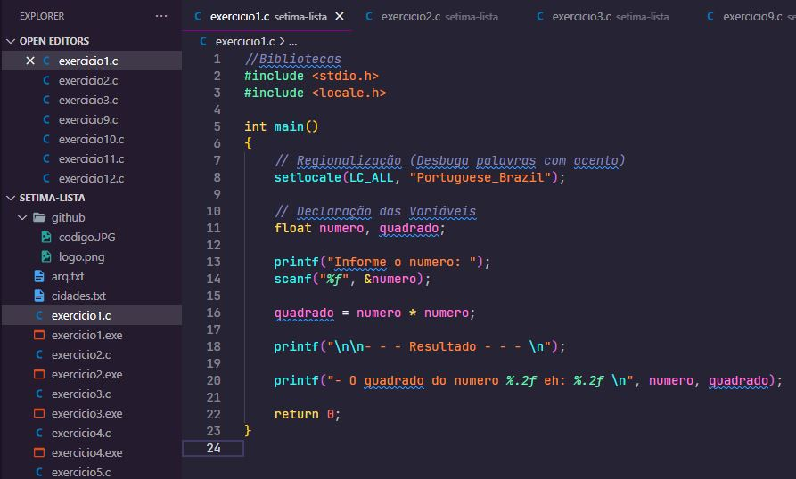

<h1 align="center">
    
</h1>

    <h3> 🔵 Sexta Lista 🔵 </h3>
    
     
    

## Lista 6

Lista de exercícios para praticar algoritmo estruturado e lógica de programação.

## Questões

1.	Efetuar a leitura de um número real e apresentar o resultado do quadrado desse número.

2.	Ler uma temperatura em graus Celsius e apresenta-la convertida em graus Fahrenheit. A fórmula de conversão é: F = C*1,8+32 - sendo F a temperatura em Fahrenheit e C a temperatura em Celsius. 

3.	Faça um programa que receba dois números e mostre qual deles é o maior.

4.	Ler um número real, se o número for positivo imprima a raiz quadrada, se não imprima o número ao quadrado. 

5.	Elabore um programa que faça leitura de vários números inteiros, até que se digite um número negativo. O programa tem que retornar o maior e o menor número lido.

6.	Escreva um programa que leia o número de habitantes de uma determinada cidade, o valor do kwh, e para cada habitante entre com os seguintes dados: consumo do mês e o código do consumidor (1-Residencial, 2-Comercial, 3-Industrial). No final imprima o maior, o menor e a média do consumo dos habitantes; e por fim o total do consumo de cada categoria de consumidor. 

7.	Escreva um programa que leia 10 números inteiros e os armazene em um vetor. Imprima o vetor, o maior elemento e a posição que ele se encontra.

8.	Escreva um programa que leia n números inteiros no intervalo [0~50] e os armazene em um vetor estaticamente alocado com 100 posições. Preencha um segundo vetor, também alocado estaticamente, apenas com os números ímpares do primeiro vetor. Imprima os dois vetores, 10 elementos por linha. 

9.	Receber um nome e imprimir as letras do nome que se encontram em índices ímpares.

10.	Ler nome, sexo e idade, se:
a.	sexo for masculino e idade maior que 0 e menor que 11. Imprime: “Menino + nome da pessoa “
b.	sexo for feminino e idade maior que 0 e menor que 11. Imprime: “Menina + nome da pessoa “
c.	sexo for masculino e idade maior ou igual a 11 e menor que 20. Imprime: “Rapaz + nome da pessoa “
d.	sexo for feminino e idade maior ou igual a 11 e menor que 20. Imprime: “Moça + nome da pessoa “
e.	sexo for masculino e idade maior ou igual a 20. Imprime: “Adulto + nome da pessoa “
f.	sexo for feminino e idade maior ou igual a 20. Imprime: “Adulta + nome da pessoa “

11.	Codifique, compile e execute um programa que:
a.	crie/abra um arquivo texto de nome “arq.txt”,
b.	permita que o usuário entre com diversos caracteres nesse arquivo, até que o usuário entre com o caractere ’0’,
c.	reinicie o arquivo, fazendo o ponteiro apontar para seu início, e
d.	lendo-o caractere por caractere, e escrevendo na tela todos os caracteres armazenados.

12.	Faça um programa em Linguagem C que receba do usuário um arquivo, e mostre na tela quantas linhas esse arquivo possui. 

## 🛠️ Linguagem

💻 C

### ☑️ Código:

## 🌟 CEFET / RJ

Essa lista foi passada no meu curso de Sistemas de Informação realizado no CEFET.

